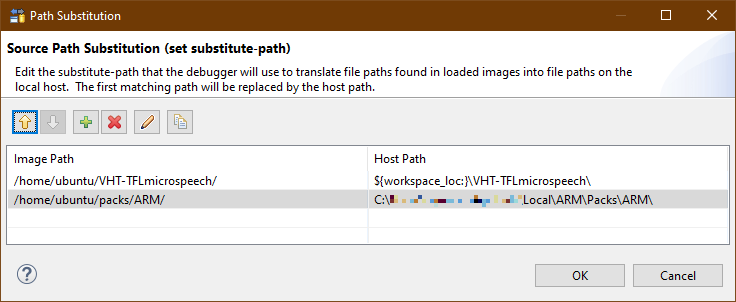
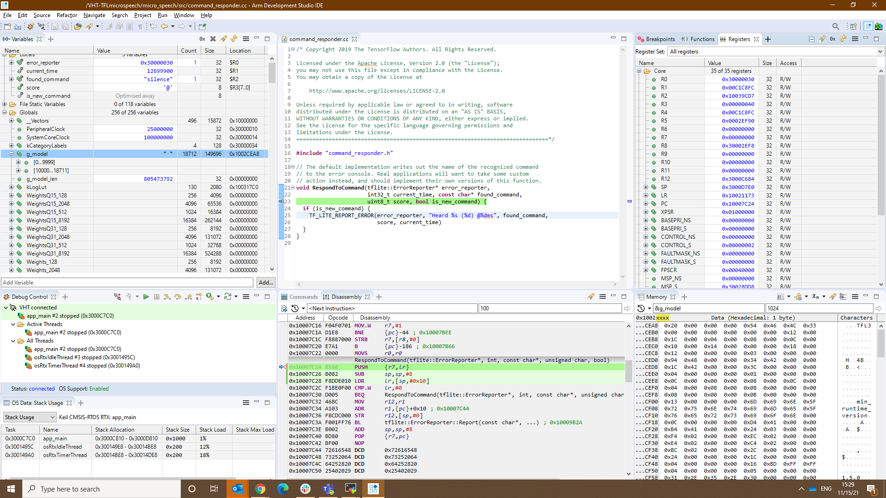

## Overview

As you adapt code base for your own needs, there is a requirement for additional debug capabilities. The [Arm Development Studio](https://developer.arm.com/Tools%20and%20Software/Arm%20Development%20Studio) debugger fully supports the necessary debug interfaces required to connect to [Arm Virtual Hardware](https://avh.arm.com/)running on the cloud from your local desktop. This article explains the necessary steps, using the [microspeech](https://github.com/ARM-software/AVH-TFLmicrospeech) reference example for Corstone-300.

## Prerequisites

* [An Arm Virtual Hardware instance running in the cloud](/iot/aws/launch)
* [Imported microspeech example to your Virtual Hardware Instance](/iot/aws/microspeech)
* Arm Development Studio](https://developer.arm.com/Tools%20and%20Software/Arm%20Development%20Studio) installed on local machine
  - See [Getting Started with Arm DS](/ide/armds/) for installation instructions if necessary

## Detailed Steps

### Run in the cloud {#runinthecloud}

The example is provided with a `run_example.sh` script that contains the necessary command options to launch the virtual hardware target with the built code image, and execute. We can concatenate additional options to this script to enable debug functionality to the model. The relevant options are:

| Command Option | Alias | Description | Comment |
| ----------- | ----------- | ----------- | ----------- |
| --iris-server | -I | Start debug server | | 
| --iris-allow-remote | -A | Allow remote connection | | 
| --iris-port <PORT> | | Specify port number to access debug server | Optional | 
| --print-port-number | -p | Display port number used to access debug server | Optional | 
| --run | -R | Run simulation | Optional | 

Specifying a port number is optional, but recommended if using in a scripted setup. If none specified, the next available port from the default (`7100`) will be used. It is also good practice to output (`-p`) the port number used.

When the target is started with the debug server, execution is halted until a debugger is connected. From there, execution control (run, step, and so on) will be controlled by the debugger, enabling you to debug from the initialization code. The `--run` option overrides this behavior and commences execution immediately. When you subsequently connect the debugger you will stop at wherever the code has reached at that time.

Launching with the debug server will also disable certain other options, such as `--cyclelimit` which limits the execution time of the target.

```console
./run_example.sh -I -A -p -R
```
Running the example with these options result in output similar to:
```
Iris server started listening to port 7100
VHT_Corstone_SSE-300_Ethos-U55: command line option --simlimit ignored because --iris-server option specified

telnetterminal0: Listening for serial connection on port 5000
telnetterminal1: Listening for serial connection on port 5001
telnetterminal2: Listening for serial connection on port 5002
telnetterminal5: Listening for serial connection on port 5003

    Ethos-U rev 136b7d75 --- Nov 25 2021 12:44:08
    (C) COPYRIGHT 2019-2021 Arm Limited
    ALL RIGHTS RESERVED

The word was yes (146) @1000ms
The word was no (145) @5600ms
...
```

### Provide SSH tunnel {#sshtunnel}

Accessing the cloud instance from a remote machine generally requires the use of a key pair. To work around this, you can use port forwarding to tunnel accesses from a given port to your local machine (`7100` in this example).
```console
ssh -i <key.pem> -N -L 7100:localhost:7100 ubuntu@<AMI_IP_addr>
```
The `-N` option holds the SSH tunnel connection and does not allow to execute other remote commands. This is useful when only forwarding ports.

### Debug from desktop {#debug}

Clone the latest image and sources from your cloud instance to your local machine.

Arm Development Studio provides ready-to-use debug configurations for Arm Virtual Hardware Targets. We can use this to connect to an already launched target. From the debugger point of view, due to SSH tunneling, the debug server appears to be on `localhost`.


In the File tab, load the debug symbols for the image running on the target from your local repository.


You can now start your debug session. The debugger connects to the remote target and stops execution.

The debugger attempts to locate and display the source code. The system paths (from the cloud instance) will likely not match your local machine. If so, you are prompted to create a path substitution. You can do this just for the base directory, and subfolders will also get populated. You will also need to do a substitution for your CMSIS Pack directory.



These substitutions are stored by this debug connection, and so subsequent debug sessions will automatically find the relevant sources. You should now have a fully featured debug environment for your application development.



## Next steps

Learn about [Arm Total Solutions for IoT](/iot/total-solutions)

[<-- Return to Learning Path](/iot/avh/#sections)
